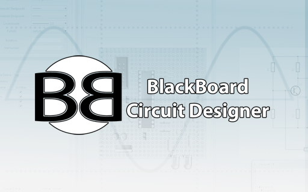
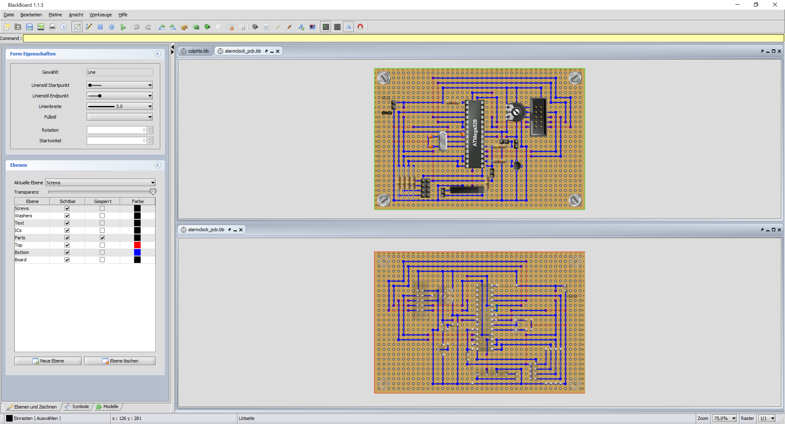
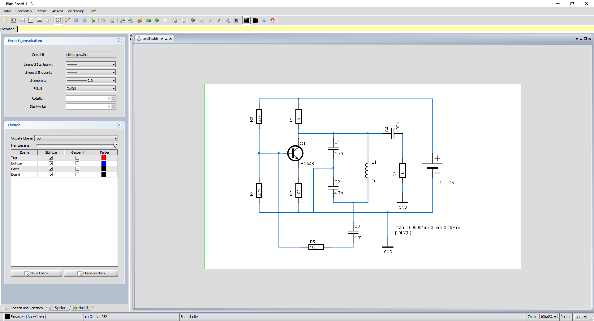
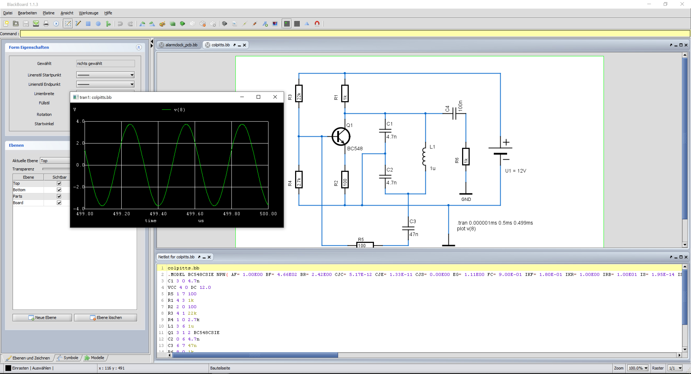
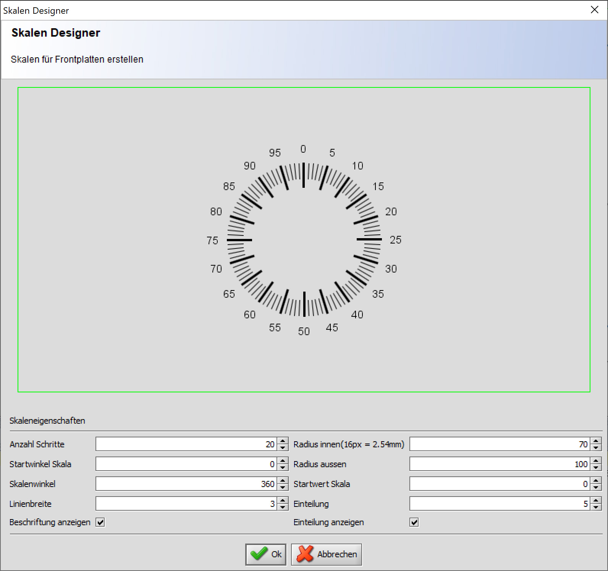
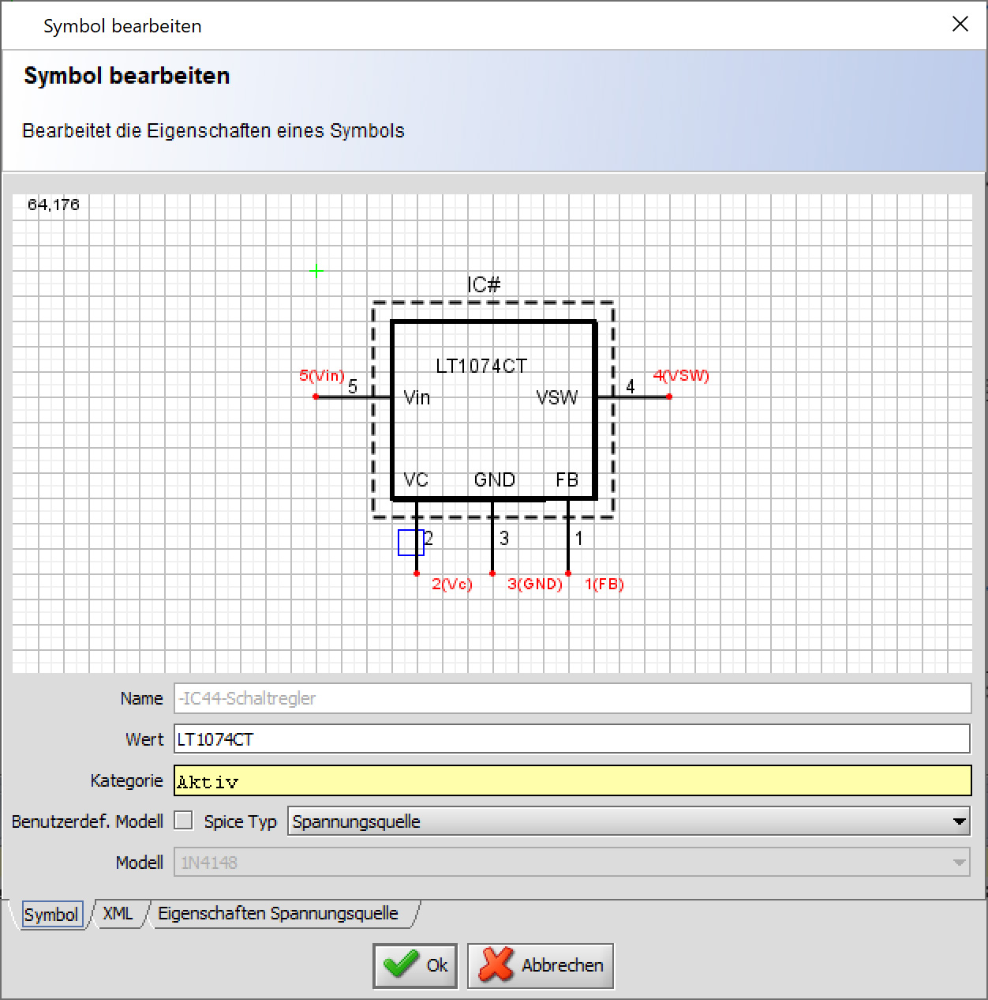
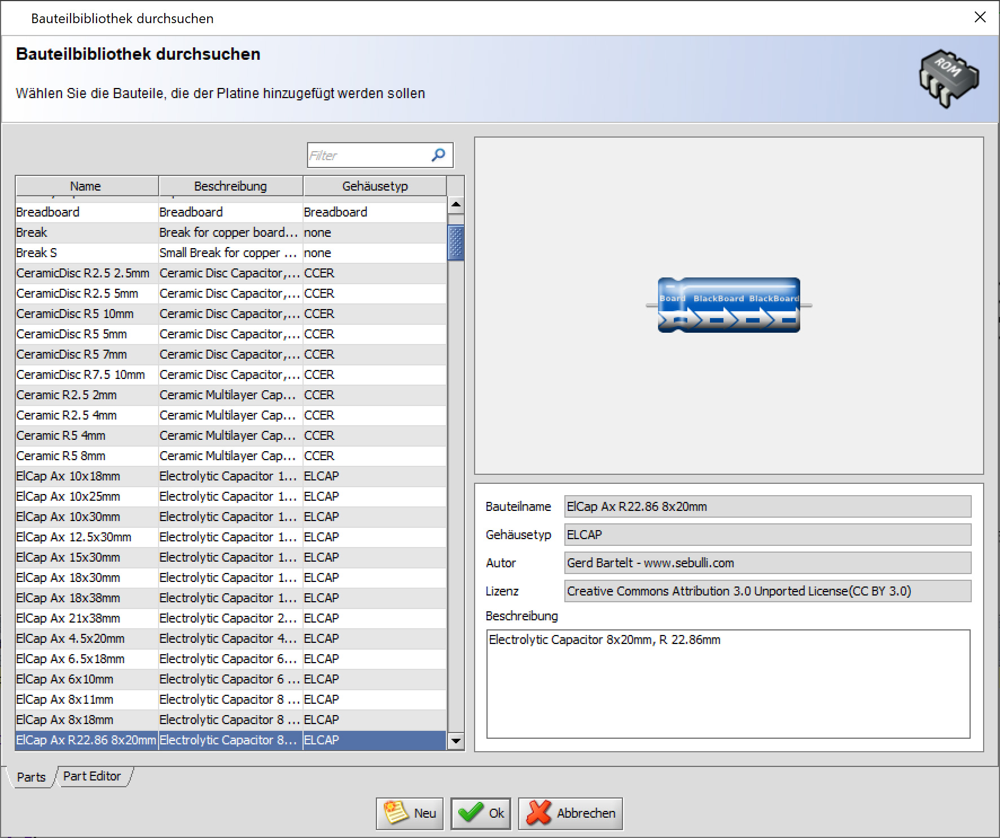

# BlackBoard Circuit Designer

Blackboard is intended for the hobby enthusiast and should help building prototypes on so called breadboards easily.

Currently BlackBoard provides the following features:

* Create so called breadboards (also stripe or perf boards) easily
* Create simple and easy to read schematics
* NGSpice integration, thus the ability to simulate the current schematic with NGSpice
* A big library of electronic parts with more than 400 pieces and library with 500 symbols 
* integrated part and symbol editor
* layer based editing

## Screenshots

This is an eclipse project, simply import it into the workspace.

In order to build blackboard, you'll need ANT to be installed. Alternatively
you can build it from within eclipse. With ANT you simply change to the BlackBoard directory
and type "ant".
 
**Important:**

All data is now stored and retrieved from users home directory. Users which use nigthly builds 
or the sources must copy the directories symbols, models, parts, datasheets and simulators 
to the folder USER_HOME/.BlackBoard 

## Installing

    $ git clone git@github.com:mpue/blackboard.git 
    $ cd blackboard
    $ ant 
    $ cp -R models ~/.BlackBoard
    $ cp -R symbols ~/.BlackBoard
    $ cp -R parts ~/.BlackBoard
    $ cp -R datasheets ~/.BlackBoard
    $ cp -R simulators ~/.BlackBoard

## Running

    $ java -Dsun.java2d.opengl=true -jar dist/lib/BlackBoard.jar
    
## Documentation 

Find the german manual here:

https://www.pueski.de/bb/doc/
